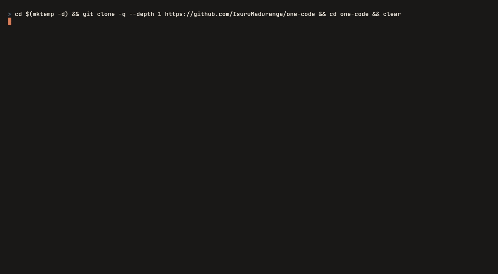

# One Code

[](https://github.com/IsuruMaduranga/one-code/actions/workflows/ci.yml)

**Claude Code with the model slot left open. The full workflow, open source, on any model or provider.**

Claude Code is a good harness. It just ships bolted to one model. One Code
unbolts it, and runs the whole workflow (subagents, git worktrees, auto mode,
ultracode workflows, plan mode) on the model you pick. Keep Claude Code for the
work that earns its best model. Reach for One Code whenever a cheaper or
different model fits the job.

The parts that make the harness good (the steering, the permission gate, the
context management) live in the harness, not the model. One Code brings all of
them across, because the good part was never the logo.

<p align="center">
  
</p>

[User guide](docs/guide/README.md) ·
[Bring your Claude Code setup](docs/guide/bring-your-claude-code-setup.md) ·
[Differences from Claude Code](docs/guide/differences-from-claude-code.md) ·
[Command reference](docs/guide/reference.md)

## ✨ What you get

- **Any model, any provider.** Anthropic, OpenAI, Gemini, OpenRouter, or a
  local model. Bring your own and switch mid-session with `/model`. Nothing
  stops you.
- **Mix providers in one session.** The parent and each subagent pick their own
  model and provider, so an ultracode workflow can fan out to a cheap tier while
  the parent stays on a frontier model. A single-gateway setup cannot do this,
  which is usually the reason people switch.
- **Your Claude Code setup runs unchanged.** `CLAUDE.md`, `.claude/commands`,
  `.claude/skills`, `.claude/agents`, `.mcp.json`, plugins, and permission rules
  are picked up as they are. No migration, and no second config file to keep in
  sync. A directory with no `CLAUDE.md` falls back to its `AGENTS.md`, the
  cross-tool convention Claude Code now reads too, so a repo written for another
  agent works here with nothing to change.
- **Capability-tiered prompting.** A weaker model gets more guidance, not less.
  Not out of politeness; it is how you get output you can use.
- **A package, not a fork.** One Code is a [pi](https://github.com/earendil-works/pi)
  package, so you extend it with your own extensions, themes, and settings.
  Forks go stale; packages do not have to.
- **Free and open source** under the MIT license.

## 🤔 "But I can already point Claude Code at Ollama"

You can:

```bash
export ANTHROPIC_BASE_URL="http://localhost:11434"
claude --model kimi-k2.7-code:cloud
```

Claude Code will happily talk to whoever picks up the phone. If one model
behind Claude Code's interface is all you want, enjoy it.

The catch: you swapped the brain and told the body nothing. Claude Code's
prompts, caching, and side calls all assume a current Claude is on the other
end, and that assumption doesn't come off with an environment variable.

One Code started as the experiment that follows from that. My
[Harness Engineering 101](https://isuruwijesiri.com/harness-engineering-101/)
series argues the model is the brain and the harness is the body, and the good
parts live in the body. So: rebuild the body from scratch on a model-neutral
runtime and put any brain in it. This repository is that rebuild, and here's
what it does that a base URL can't.

- **One phone line.** You can rename the subagent model in Claude Code, but
  every call, main agent, subagents, classifier, compaction, still dials the one
  endpoint behind that URL. Mixing providers means running a routing gateway
  and maintaining it. One Code gives each seat its own brain on its own
  provider, natively. A frontier model in charge, DeepSeek V4 Flash running
  twelve subagents. That's the setup this was built for.
- **Subscriptions don't fit behind a base URL.** A gateway wants API keys. One
  Code signs you in with the account you already pay for: Claude Pro and Max,
  ChatGPT, GitHub Copilot, OpenRouter, Kimi, xAI, and Radius all have native
  OAuth logins, and you can mix them in one session.
- **Someone else's prompt.** Claude Code's prompt is about 8k characters,
  because Claude 5 doesn't need hand-holding. Give it to a smaller model and
  you get a stranger reading Claude's notes. One Code sizes the prompt to the
  model in four tiers, down to playbooks and strict-schema search tools for
  flash-class and local models. Weaker brains need more body.
- **Cache misses, billed to you.** Anthropic caches at explicit `cache_control`
  markers; most other providers cache on an exact prefix, and the two do not
  line up. A gateway that translates between them silently maps the markers
  wrong, so the cache sticks at the system prompt and never advances, or never
  forms at all. Nothing errors. You just pay full price every turn. This is not
  hypothetical: users report proxies where the cache-creation count is zero on
  every turn and half the turns re-bill the whole context, and Claude Code's own
  attribution header defeats caching behind a base URL unless you know the flag
  to turn off. One Code speaks each provider's native API, keeps the prefix
  byte-stable, and shows the live hit rate in the footer, because one careless
  byte up top is a tenfold price increase.
- **Anthropic-only parts.** Deferred tools, server-side web search, the
  thinking block. A foreign endpoint drops them. One Code has a
  provider-neutral version of each.
- **Side jobs that ask for Haiku by name.** Your gateway had better know who
  that is. One Code picks side models from your provider's own catalog, with
  a capability floor.
- **A knob, not a toolbox.** Claude Code isn't open source; the base URL is
  the one knob. One Code is pi extensions all the way down, so anything
  missing is one more extension.

The base URL trick swaps the brain and hopes the body doesn't notice. One Code
is the body that was built to notice.

## 🚀 Get started

You need **Node.js 22.19+**. One Code is developed and verified on macOS and
Linux; WSL works too. Native Windows runs in Claude Code's shape (Git Bash
optional, PowerShell tool) — see the [Windows guide](docs/guide/windows.md).

```bash
npm install -g @one-ai/one-code
cd your-project
onecode
```

Inside One Code, run `/login` to connect a provider, then `/model` to pick a
model. You can also pass a provider key through an environment variable such as
`ANTHROPIC_API_KEY`, `OPENAI_API_KEY`, or `OPENROUTER_API_KEY`.

Open a project that already has a `CLAUDE.md` or `.claude/` setup and One Code
reuses it right away. Starting fresh? `/init` drafts a `CLAUDE.md` for you.

Not sure what is wired up? Run `onecode doctor` (or `/doctor report` inside a
session). It reports which providers have credentials, which model each role
uses, what of your Claude Code configuration was picked up, and which programs
are missing. `/doctor` runs the full checkup and has the model fix what it finds.

One Code is free. Model access, usage charges, and rate limits are between you
and your provider. See [Providers and models](docs/guide/providers-and-models.md)
for connection options.

### Other ways to install

**Homebrew** installs Node for you:

```bash
brew install isurumaduranga/one-ai/onecode
```

**Windows** without Node.js? This fetches Node for you and installs the app:

```powershell
powershell -c "irm https://raw.githubusercontent.com/IsuruMaduranga/one-code/master/install.ps1 | iex"
```

**Already on pi?** Add the extensions to your existing installation:

```bash
pi install npm:one-code-extension
```

The app package, [`@one-ai/one-code`](https://www.npmjs.com/package/@one-ai/one-code),
bundles a pinned pi and gives you the `onecode` command. The extension package,
[`one-code-extension`](https://www.npmjs.com/package/one-code-extension), runs on
your own pi and is tested against pi 0.83 to 0.86; use `pi` in place of `onecode`
for that install.

The app opens in a full-screen terminal interface by default. See the
[installation guide](docs/guide/installation.md) for display settings and more.

## 🎛️ Put different models to work

A main conversation and a repository-wide investigation do not need the same
model. Keep your preferred model in charge and let subagents use another
provider for exploration, tests, or review.

1. Choose the main model with `/model`.
2. Set the default for subagents and workflow agents with
   `/subagent <provider/model-id>`.
3. Ask for delegated work, for example:

   > Use subagents to investigate the authentication code and its tests.
   > Have them report their findings, then make the fix in the main session.

Agent definitions in `.claude/agents/` can name their own model, tools, and
instructions. Use `/agents` to follow their progress and `/model` to change the
main model as the task changes.

This is where you decide where the money goes. Actual cost and quality depend on
the models, the task, and how much you delegate.

[Subagents and workflows →](docs/guide/subagents-and-workflows.md)

## ♻️ Reuse the setup you already have

One Code reads Claude Code configuration directly. There is no import step.

| Your configuration | How One Code uses it |
|---|---|
| `CLAUDE.md` | Project instructions, including nested files and `@path` imports. Falls back to `AGENTS.md` when a directory has no `CLAUDE.md`. |
| `.claude/skills/` and `.claude/commands/` | Discoverable skills and slash commands. |
| `.claude/agents/` | Subagent definitions with their model, tools, and instructions. |
| `.claude/settings.json` | `allow`, `deny`, and `ask` permission rules, plus supported command hooks. |
| `.mcp.json` | MCP servers with tools loaded on demand. |
| Installed Claude Code plugins | Plugin agents, skills, commands, and MCP servers, namespaced by plugin. |

Claude Code tool names such as `Read`, `Bash`, `Edit`, and `Task` work in
permission rules and hook matchers. One Code keeps its own settings separately
and treats `~/.claude` as read-only, so nothing you already have gets rewritten.

Compatibility covers configuration and workflow surfaces. Features and skills
that need Claude Code's own hosted or desktop services are not included.

[Configuration details →](docs/guide/bring-your-claude-code-setup.md) ·
[Skills, plugins, and MCP →](docs/guide/skills-plugins-and-mcp.md)

## ⚙️ Workflows that scale with the task

### Subagents and git worktrees

Give an investigation its own context window and bring the result back to the
main conversation. Subagents run in the background, take follow-up messages, and
can fork the current conversation when they need its context. Three agent
definitions ship with One Code: `general-purpose`, `explore`, and `plan`.

For parallel edits, give agents their own git worktrees. You can also move the
whole session into a worktree with `enter_worktree` and leave it with
`exit_worktree`.

### Ultracode workflows

Put **`ultracode`** in a request for a broad audit, migration, or review. The
model writes a JavaScript workflow that coordinates agents in parallel, with
progress visible in `/workflows`. Use `/effort ultracode` to keep this behavior
on across turns.

Resume an interrupted run to reuse completed agent calls whose inputs still
match. Save reusable scripts in `.claude/workflows/` to call them by name.
Optional output-token targets stop new and queued agents once reached;
agents already running can finish above the target.

### Permissions and planning

**Auto mode is the default.** A classifier judges actions that need review,
while permission rules and deterministic checks enforce the rest. `deny` rules
beat `allow` rules. Trust approval covers project-provided hooks, MCP servers,
and allow rules.

Press **ctrl+q** (**alt+m** on Windows and WSL) to cycle through manual, accept-edits, plan, and auto modes.
Plan mode lets the agent investigate and write a plan file before you approve
implementation. Use `/permissions` to inspect rules and `/auto-mode` to
configure the classifier.

The permission system is an application-level control. For OS-level isolation,
run One Code inside a container. The guide spells out the guarantees and the
known gaps.

[Permissions and modes →](docs/guide/permissions-modes-and-auto-mode.md) ·
[Hooks →](docs/guide/hooks.md)

## 🧰 Everyday tools

| Capability | What you get |
|---|---|
| Code and files | Read, write, edit, shell commands, background processes, repository search, and notebook editing. |
| Web | Search and fetch, with provider search or Brave, Tavily, and Exa fallbacks. |
| Diagnostics | Language-server diagnostics after edits; install the relevant server on your `PATH`. |
| Long sessions | Per-repository memory, a session scratchpad, and context compaction. |
| Task tracking | A pinned progress widget, background monitors, and scheduled wake-ups. |
| Tool discovery | Deferred tools loaded when needed to keep prompt overhead down. |
| Reasoning and appearance | `/effort` or **shift+tab** for reasoning effort; `onecode` and `onecode-light` themes. |
| Customization | Extend One Code with pi extensions, themes, and settings. |

The bundled skills include `simplify`, `code-review`, `security-review`, and
`fewer-permission-prompts`. A project skill with the same name wins.

For scripting and session management:

```bash
onecode -p "Explain how authentication works in this repository"
onecode -c                       # continue the previous session
onecode --mode json              # JSON event output
onecode --permission-mode plan   # start in plan mode
```

See [Tools](docs/guide/tools.md) for every tool the model can call and the
[command reference](docs/guide/reference.md) for every command, shortcut, flag,
and environment variable.

## 📚 Documentation

The [user guide](docs/guide/README.md) covers everything: installation,
providers and models, the terminal interface, configuration, permissions and
auto mode, hooks, subagents and workflows, skills, plugins, and MCP, tools,
sessions and context, background work, the doctor, differences from Claude Code,
troubleshooting, and a full reference.

## 💡 Good to know

- **Providers:** end-to-end testing has focused on Anthropic, OpenAI, and
  OpenRouter. Other providers are less exercised, so expect the occasional rough
  edge.
- **Web search:** set `BRAVE_SEARCH_API_KEY` or `TAVILY_API_KEY` on a provider
  without native search. With neither key, the fallback is Exa's rate-limited
  keyless endpoint, and One Code labels those results.
- **Native Windows:** shells, hooks, and the PowerShell tool follow Claude
  Code's behavior and pass on Windows CI runners, but a real Windows desktop
  session hasn't been driven end to end yet. Expect rough edges around
  drive-letter paths in permission rules; WSL remains the safest route.

## 🔧 Install from source

This installs the local extensions into an existing pi installation:

```bash
git clone https://github.com/IsuruMaduranga/one-code
cd one-code
npm install
cd ..
pi install ./one-code
pi list
```

## 🧠 Learn the ideas behind it

One Code is the production-scale companion to
[Harness Engineering 101](https://isuruwijesiri.com/harness-engineering-101/),
a sixteen-chapter series that builds these ideas up from first principles: what
a coding harness actually does, why the good parts are model-independent, and
how a ~300-line toy agent grows into the patterns you see here. The series
points at this repository wherever it needs a grown-up example.

## 📄 License

[MIT](LICENSE). Contributions welcome.
